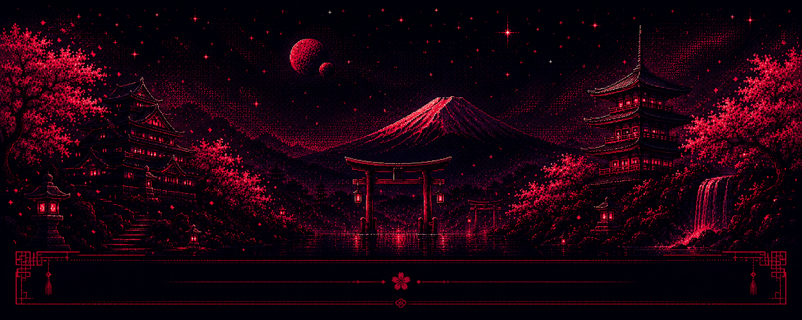
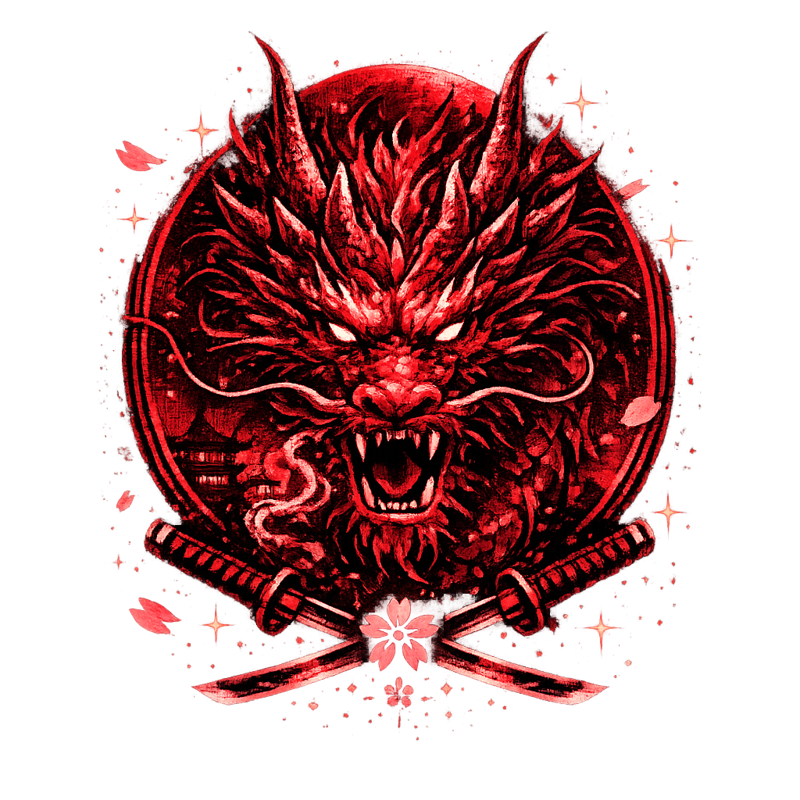
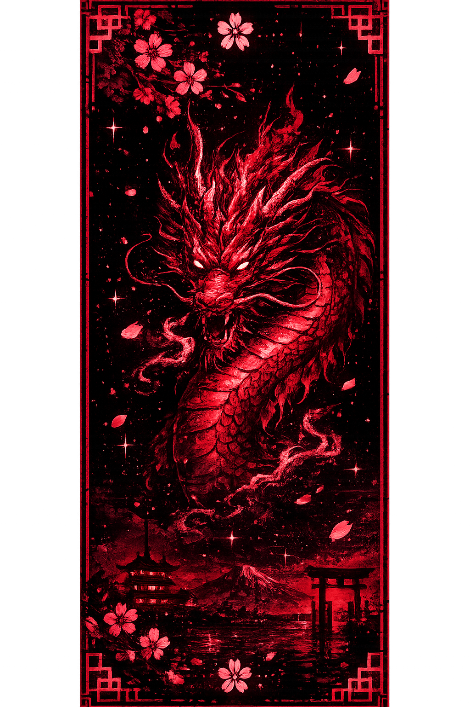
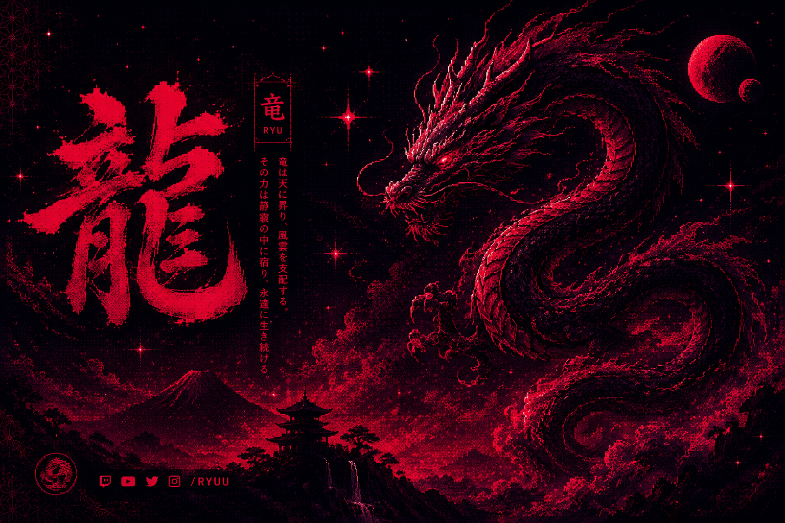
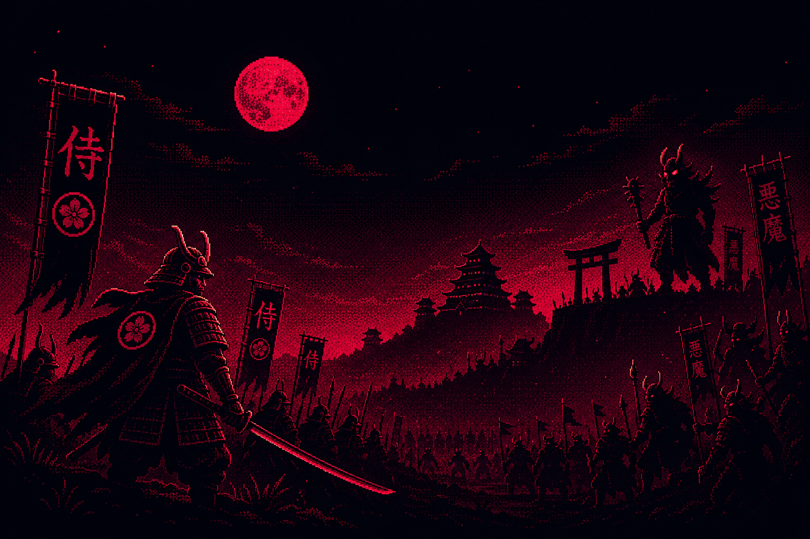
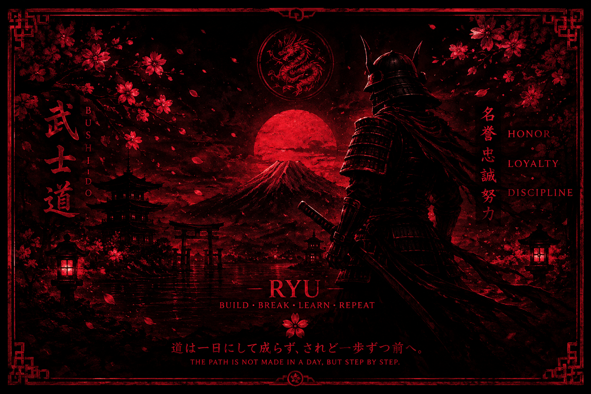

<!--Pretendo add mais coisas uteis aqui ;( -->
---

 

# Manoel E. S. S 
`Software Engineering` • `Systems Development` • `Programming`

---

# 武蔵 • RYU

>「龍は風を追わない、風になる。」

> *Ryu does not chase the wind. It becomes the wind.*

 

>>>

Profissional de tecnologia com formação técnica em ***Desenvolvimento de Sistemas*** e estudante de ***Engenharia de Software e Análise e Desenvolvimento de Sistemas (ADS)***. Possuo foco em desenvolvimento de software, engenharia de sistemas, programação, segurança, arquitetura de soluções e modelagem de sistemas. Perfil analítico, orientado à resolução de problemas, aprendizado contínuo e construção de soluções com base técnica. 

---

 

### Stacks 

 

 

---

#### Tools • Environment • Engineering

 

 

 

---

 

---
# Days Streaks 

---

---

#### ⛩ Trophy Hall

---

---

# 武蔵 • RYU

>「龍は風を追わない、風になる。」

<align center>
